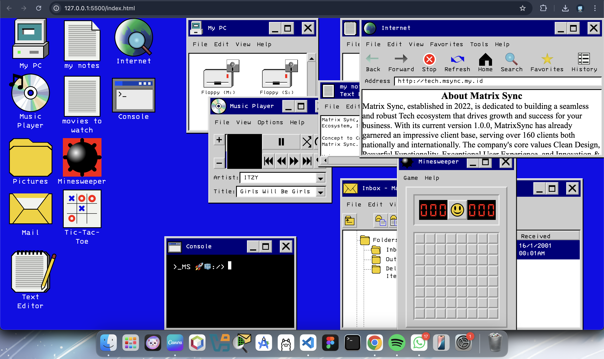

# CSS Only Retro Desktop 

This is an adaptive, and interactive CSS Only Retro Desktop About Matrix Sync!
Step into the past and relive the magic of the late '90s 💾 — experience what it was like to use a retro desktop like no other!
My first desktop was Windows XP, and the nostalgia it brings still inspires me today. While this is more of a Windows 95 replica, it's a tribute to that lost retro era.

Click on each icon to open the corresponding window.
